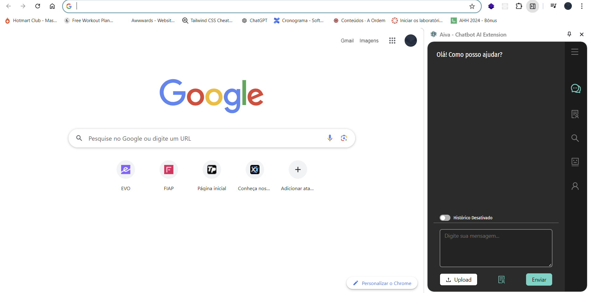

# Seja bem vindo a Extensão que irá te ajudar no seu dia dia, AIVA sua assistente virtual da softtek

### Dentro dessa pasta temos duas pastas

- Projeto React
- Extensão AIVA

Pois para executar a extensão é necessário fazer o build do projeto, então já deixamos isso pronto

## Passo a passo para executar a extensão no google chrome

- Entre no seu navegador e clique em "extensões", em seguida clique em "Gerenciar extensões", segue print abaixo

- Habilite o "modo de desenvolvedor"

- Clique em "Carregar sem compactação"

- Navegue até onde você baixou o projeto e escolha a pasta "extension", e clique em "selecionar pasta"

- Pronto a AIVA já está em seu navegador.

## Iniciar a AIVA

- Para iniciar a AIVA, por se tratar de um painel lateral do google, precisa clicar com o botão direito na extensão e abrir painel lateral.

- Pronto AIVA abrindo no menu lateral e pronta para uso

